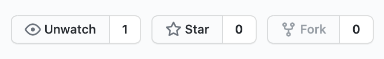
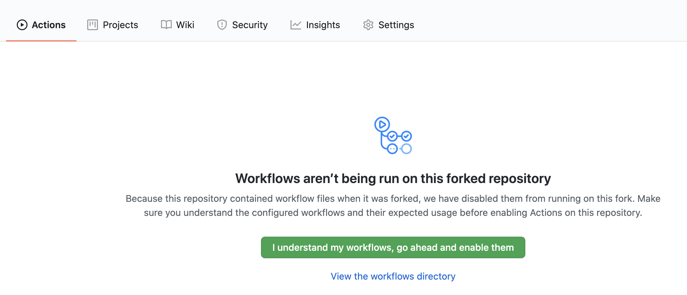
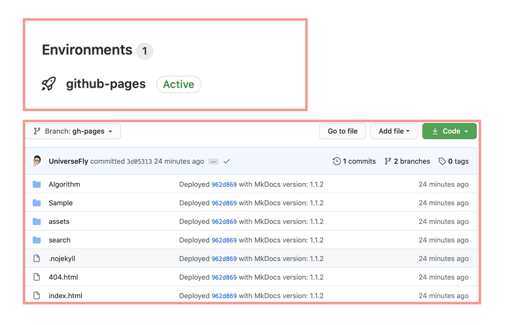
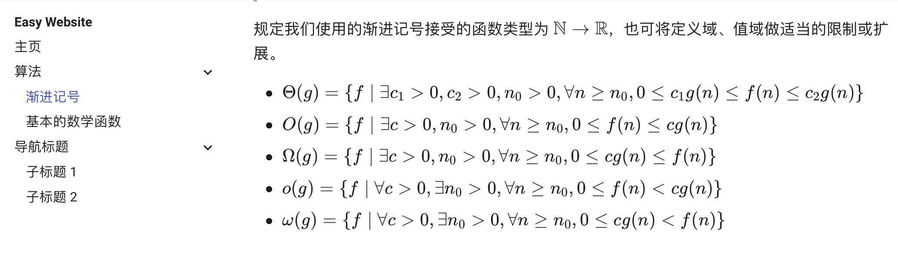

# EasyWebsite

只需要四步，即可动态部署自己的个性化网页，用来写博客、做笔记等：

### 第一步：Fork 并开启 GitHub Action

Fork 这个仓库（下图最右侧的 Fork 按钮），随后会在自己的仓库列表中下看到它：



Fork 结束后，在自己仓库中的 GitHub Action 模块，点击中间绿色按钮开启 Action：



### 第二步：修改示例文件

在自己 Fork 的仓库中，把 `docs/Sample/SampleFile1.md` 里的内容修改成自己的内容（可以 `clone` 到本地再 `push`，也可以直接在线修改作为尝试）。

### 第三步：设置 GitHub Pages

在自己 Fork 的仓库里，进入 Settings，找到 Options 里的 GitHub Pages 设置选项，将里面的 Sources 先切换成 master 再切换回 gh-pages（似乎是 GitHub Action 的 bug，所以必须这么做）。


如果操作顺利，可以看到自己仓库的 Environment 里多了 GitHub Pages，同时分支也多了个 gh-pages 分支：



### 第四步：进入网页查看效果

`https://${yourUsername}.github.io/EasyWebsite`（例如我的用户名是 UniverseFly，只需要进入 https://UniverseFly.github.io/EasyWebsite 即可），查看左侧导航栏中的 `导航标题->子标题 1`，里面的内容会变成刚刚修改的新内容。（注意，这里可能会出现 404，这是因为它部署需要一段时间，稍等一会即可）


## 了解更多？

### 网页生成手段

- 网页是使用静态网页生成器 [mkdocs](https://github.com/mkdocs/mkdocs) 生成的，整个 gh-pages 分支内就是生成后的网页。
- 而自动化部署的实现利用了 GitHub Action 这个新技术，部署脚本在 `.github/workflows/main.yml` 这个文件里。

### 如何自定义网页导航、添加自己的 md 文件？

mkdocs 所有需要生成网页的 md 文件都在仓库根目录下的 `docs` 文件夹里，而根目录中 `mkdocs.yml` 是配置文件，配置文件的 nav 栏目定义了导航方法、以及最终可以在网页中看到的一则则标题，按照格式增加、修改 nav 里的内容，以及对应 docs 下的文件即可（注意不要动 `docs` 里的 `KatexAddition`，它用来显示数学公式）

mkdocs.yml 里的 nav（注意，里面的路径相对的是 `docs` 目录）

```yml
nav:
  - 主页: index.md

  - 算法:
    - 渐进记号: Algorithm/AsymptoticNotation.md
    - 基本的数学函数: Algorithm/BasicMathFunction.md

  - 导航标题:
    - 子标题 1: Sample/SampleFile1.md
    - 子标题 2: Sample/SampleFile2.md
```

对应的网页导航栏：



